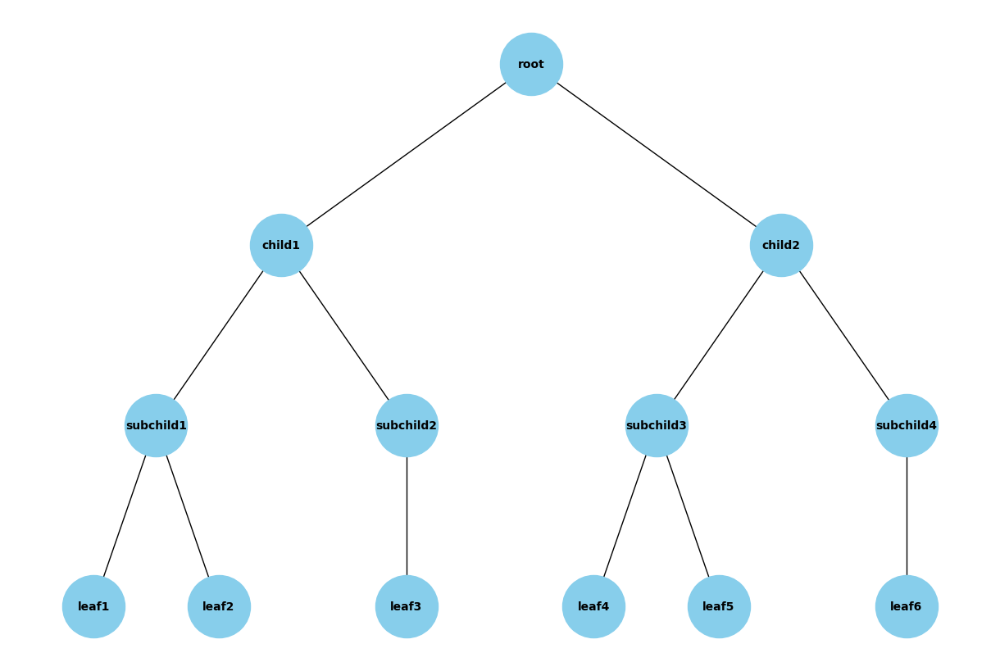
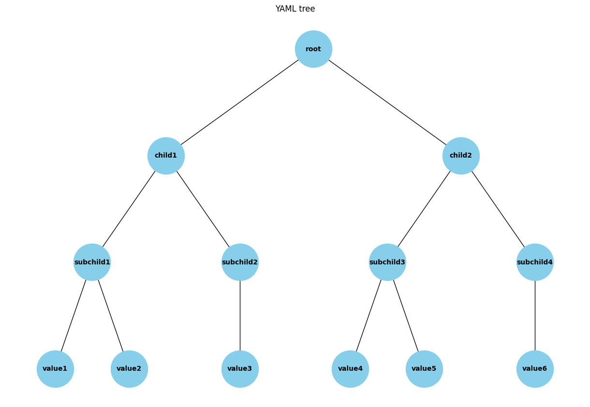

# YAML Tree Visualization
Provides a Python script to visualize a hierarchical tree structure defined in a YAML file. The script generates 2 tree diagrams: one displaying the keys and another displaying the values.

### Features
Visualizes hierarchical tree structures from YAML files.
Generates separate tree diagrams for keys and values.
Uses networkx and matplotlib for plotting.

